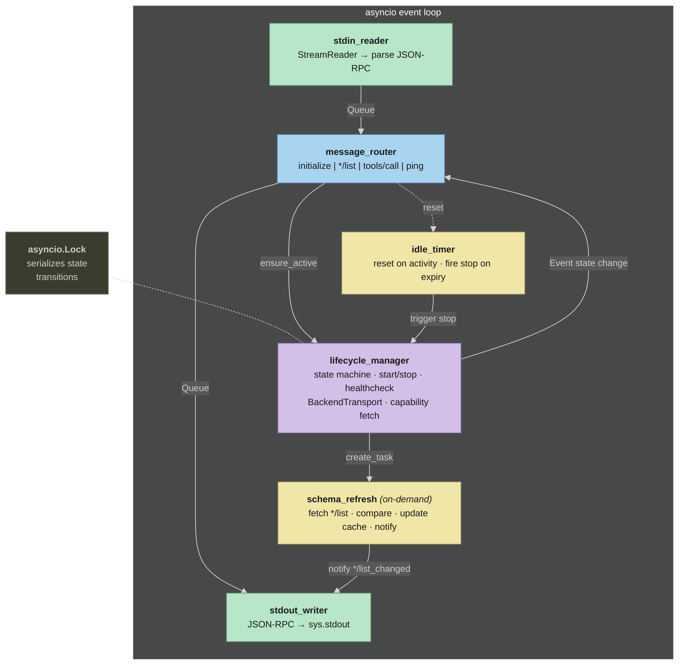
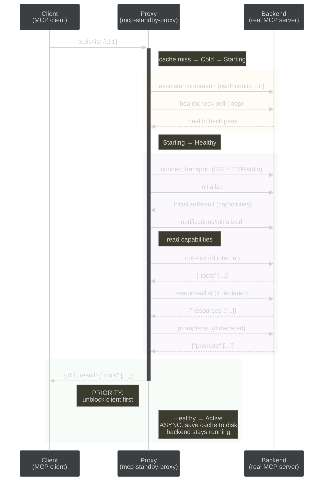

# Technical Specification — mcp-standby-proxy

**Status:** APPROVED
**Date:** 2026-04-10
**Related:** [PRD](prd.md) | [Tech Stack](tech-stack.md) | [Config Spec](config-spec.md)

---

## 1. Core Abstraction: BackendTransport Protocol

The proxy communicates with backends through a single `Protocol` class. Three
implementations: `SseTransport`, `StreamableHttpTransport`, `StdioTransport`.

```python
from typing import Protocol, Any


class BackendTransport(Protocol):
    """Protocol for communicating with a backend MCP server.

    Implementations handle framing, connection management, and transport details.
    """

    async def connect(self) -> None:
        """Establish connection to backend.

        For stdio: spawn child process via asyncio.create_subprocess_exec.
        For SSE: GET the SSE endpoint, receive 'endpoint' event, note POST URL.
        For Streamable HTTP: no persistent connection (stateless POST per request).
        """
        ...

    async def request(self, method: str, params: Any = None, id: Any = None) -> dict:
        """Send JSON-RPC request and return the response as a raw dict.

        The transport handles framing (newline-delimited JSON, HTTP POST, etc.)
        and correlates request ID to response.
        """
        ...

    async def notify(self, method: str, params: Any = None) -> None:
        """Send JSON-RPC notification (no response expected)."""
        ...

    async def close(self) -> None:
        """Gracefully close connection.

        For stdio: close stdin, wait, SIGTERM, SIGKILL.
        For SSE: close the SSE connection.
        For Streamable HTTP: send DELETE if session exists.
        """
        ...

    def is_connected(self) -> bool:
        """Check if transport connection is alive."""
        ...
```

**SDK integration note:** SSE and Streamable HTTP transports wrap the `mcp` SDK's
context managers (`sse_client()`, `streamable_http_client()`). These are entered via
explicit `__aenter__()`/`__aexit__()` because the connection spans the proxy's session
lifetime — not a single request scope.

## 2. Concurrency Model

The proxy runs six cooperating asyncio tasks within a single event loop:



**Inter-task communication:**

- `asyncio.Queue` for stdin -> router and router -> stdout (backpressure-safe I/O)
- `asyncio.Event` for lifecycle state transitions and idle timer resets
- `asyncio.Lock` for serialized state transitions (held for entire transition duration)
- `asyncio.Lock` for serialized transport writes (if protocol requires it)

**Invariant:** State transitions hold the lock for the entire transition duration.
No concurrent transitions. Requests arriving mid-transition are queued and drained
when the terminal state is reached (Active: forward all, Failed: error all).

## 3. Key Flows

### 3.1 Cold Cache Bootstrap (tools/list with no cache)

Triggered when client sends `tools/list` (or any `*/list`) and no cache file exists.
This is the most complex flow — it combines lifecycle startup with cache creation.



**Key ordering constraint:** Return the triggering `*/list` response to the client
*before* writing the cache file. The client must not wait for disk I/O.

### 3.2 Background Schema Refresh (post-MVP, FR-10)

Triggered after entering Active state when a cache already existed (i.e., the backend
was started by `tools/call`, not by a cache-miss `*/list`).

1. Read `capabilities` from the backend's `InitializeResult`.
2. For each declared capability (`tools`, `resources`, `prompts`), fetch `*/list`.
3. Compare each response with the corresponding cached version.
4. If different: update cache file on disk, send `notifications/*/list_changed`
   per changed capability (e.g., `notifications/tools/list_changed`).
5. If all same: no action.

After receiving `*/list_changed`, the client sends a new `*/list` request. The proxy
responds from the now-updated cache.

## 4. Capability Resolution

MCP clients use the `capabilities` field from the `initialize` response to decide
which methods to call. If `capabilities` is empty, the client will not send
`tools/list` — preventing cold bootstrap (FR-1.3) from ever triggering.

**Resolution logic (FR-1.1a/b/c):**

```
initialize request received
├── cache exists?
│   ├── yes → capabilities non-empty?
│   │   ├── yes → use cached capabilities
│   │   └── no  → use _DEFAULT_CAPABILITIES {"tools": {}}
│   └── no  → use _DEFAULT_CAPABILITIES {"tools": {}}
```

**During cold bootstrap (cache write):**

Some backends return empty `capabilities` in their `initialize` response (e.g.,
Firecrawl MCP in stateless mode). When this happens, the proxy derives capabilities
from the methods it successfully fetched:

- `tools/list` fetched → `{"tools": {}}`
- `resources/list` fetched → `{"resources": {}}`
- `prompts/list` fetched → `{"prompts": {}}`

If no methods were fetched and backend capabilities are empty, fall back to
`_DEFAULT_CAPABILITIES`. This ensures the cache always contains usable capabilities.

**Constant:** `_DEFAULT_CAPABILITIES = {"tools": {}}` — every MCP server has tools;
this is the safe minimum to advertise.

## 5. Error Scenarios

Edge cases beyond the primary failure paths covered by PRD (FR-3.5, US-005):

1. **Backend crashes mid-session.** Transport detects disconnection (EOF on stdio,
   connection reset on HTTP/SSE). State: Active -> Failed. In-flight requests receive
   JSON-RPC errors. After cooldown -> Cold. Next request triggers restart.

2. **Stop command fails.** Log warning, transition to Cold anyway. Backend may be in
   unknown state. Next start attempt may find leftover from previous run — if
   healthcheck passes immediately, the restart is fast.

3. **Transport connection fails after healthcheck passes.** Possible when healthcheck
   targets a different endpoint than the MCP transport. State: Healthy -> Failed.
   Queued requests receive errors. Log the mismatch for debugging.

4. **Cache bootstrap failure.** Backend starts but `*/list` fetch fails (timeout,
   invalid response). Return JSON-RPC error for the triggering `*/list` request.
   Cache file is NOT written (no partial cache). Backend stays running — idle timeout
   handles shutdown. Client can retry.

## 6. JSON-RPC ID Mapping

The proxy remaps `id` fields to prevent collisions between client-originated and
proxy-originated requests (initialize, schema refresh):

- Client sends request with `id: N`
- Proxy forwards to backend with internal id (e.g., `"p-1"`, `"p-2"` — monotonic counter)
- Backend responds with the internal id
- Proxy maps back to the original `id: N` before sending to client

The mapping is maintained in a `dict[str, JsonRpcId]` for the lifetime of each
in-flight request. Proxy-originated requests (initialize, `*/list` for cache) use
internal IDs that never appear on the client-facing side.
