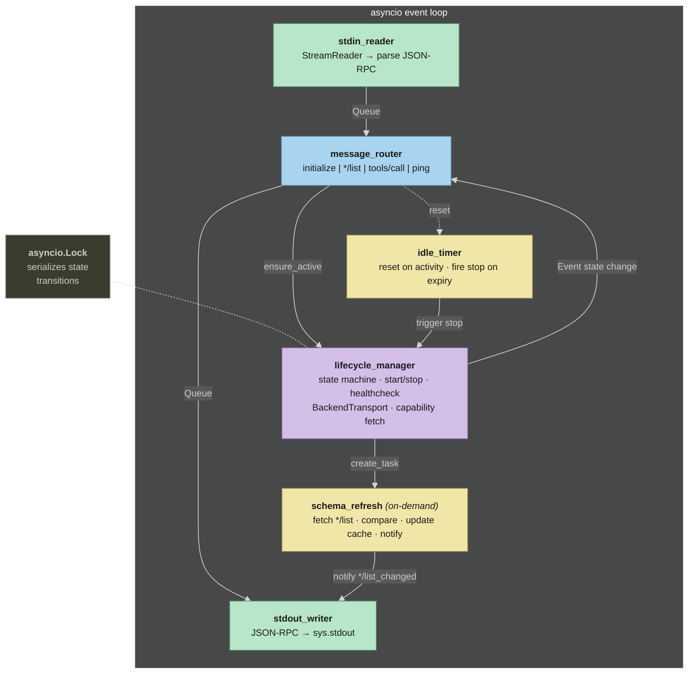
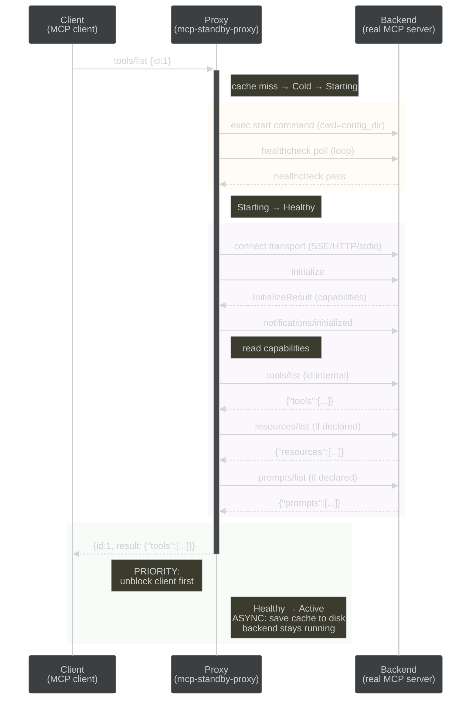

# Technical Specification — mcp-standby-proxy

**Status:** APPROVED
**Date:** 2026-04-10
**Related:** [PRD](prd.md) | [Tech Stack](tech-stack.md) | [Config Spec](config-spec.md)

---

## 1. Core Abstraction: BackendTransport Protocol

The proxy communicates with backends through a single `Protocol` class. Three
implementations: `SseTransport`, `StreamableHttpTransport`, `StdioTransport`.

```python
from typing import Protocol, Any


class BackendTransport(Protocol):
    """Protocol for communicating with a backend MCP server.

    Implementations handle framing, connection management, and transport details.
    """

    async def connect(self) -> None:
        """Establish connection to backend.

        For stdio: spawn child process via asyncio.create_subprocess_exec.
        For SSE: GET the SSE endpoint, receive 'endpoint' event, note POST URL.
        For Streamable HTTP: no persistent connection (stateless POST per request).
        """
        ...

    async def request(self, method: str, params: Any = None, id: Any = None) -> dict:
        """Send JSON-RPC request and return the response as a raw dict.

        The transport handles framing (newline-delimited JSON, HTTP POST, etc.)
        and correlates request ID to response.
        """
        ...

    async def notify(self, method: str, params: Any = None) -> None:
        """Send JSON-RPC notification (no response expected)."""
        ...

    async def close(self) -> None:
        """Gracefully close connection.

        For stdio: close stdin, wait, SIGTERM, SIGKILL.
        For SSE: close the SSE connection.
        For Streamable HTTP: send DELETE if session exists.
        """
        ...

    def is_connected(self) -> bool:
        """Check if transport connection is alive."""
        ...
```

**SDK integration note:** SSE and Streamable HTTP transports wrap the `mcp` SDK's
context managers (`sse_client()`, `streamable_http_client()`). These are entered via
explicit `__aenter__()`/`__aexit__()` because the connection spans the proxy's session
lifetime — not a single request scope.

## 2. Concurrency Model

The proxy runs six cooperating asyncio tasks within a single event loop:



**Inter-task communication:**

- `asyncio.Queue` for stdin -> router and router -> stdout (backpressure-safe I/O)
- `asyncio.Event` for lifecycle state transitions and idle timer resets
- `asyncio.Lock` for serialized state transitions (held for entire transition duration)
- `asyncio.Lock` for serialized transport writes (if protocol requires it)

**Invariant:** State transitions hold the lock for the entire transition duration.
No concurrent transitions. Requests arriving mid-transition are queued and drained
when the terminal state is reached (Active: forward all, Failed: error all).

### 2.1 Logging handlers in the event loop (FR-19, FR-21)

Both the stderr handler (`logging.StreamHandler`) and the optional file
handler (`logging.handlers.RotatingFileHandler`) are **synchronous**.
`logger.warning(...)`, `logger.info(...)`, etc. called from any of the six
asyncio tasks above will block the event loop for the duration of the
write (stderr: typically a pipe to the parent, sub-millisecond; file: disk
I/O + possible rotation, potentially milliseconds under DEBUG with large
Kroki-style base64 payloads).

**MVP acceptance:** sync I/O is acceptable because (a) stderr is already a
sync pipe in the current design and its cost has been measured acceptable;
(b) the file handler is opt-in via FR-21 and defaults to `info` level (no
payload-level records by default — see config-spec §3 `logging`); (c) the
dominant latency source is the backend transport, not logging.

**Regression trigger:** if the `proxy routing latency < 100ms` success
metric (PRD §6.1) regresses when `logging.file.level: debug` is used in
real traffic, migrate to stdlib `QueueHandler` + a listener thread.
`QueueHandler` hands records off to a background thread that performs the
file I/O, releasing the event loop immediately. Post-MVP; tracked as a
follow-up, not a blocker.

**No file-handler lock required.** `RotatingFileHandler.emit` acquires
`self.lock` (threading.RLock) around each write/rollover; single-process
safety is inherited from stdlib. Multi-process safety is NOT provided
(PRD §7 risk row: multiple proxies on the same log path).

## 3. Key Flows

### 3.1 Cold Cache Bootstrap (tools/list with no cache)

Triggered when client sends `tools/list` (or any `*/list`) and no cache file exists.
This is the most complex flow — it combines lifecycle startup with cache creation.



**Key ordering constraint:** Return the triggering `*/list` response to the client
*before* writing the cache file. The client must not wait for disk I/O.

### 3.2 Background Schema Refresh (post-MVP, FR-10)

Triggered after entering Active state when a cache already existed (i.e., the backend
was started by `tools/call`, not by a cache-miss `*/list`).

1. Read `capabilities` from the backend's `InitializeResult`.
2. For each declared capability (`tools`, `resources`, `prompts`), fetch `*/list`.
3. Compare each response with the corresponding cached version.
4. If different: update cache file on disk, send `notifications/*/list_changed`
   per changed capability (e.g., `notifications/tools/list_changed`).
5. If all same: no action.

After receiving `*/list_changed`, the client sends a new `*/list` request. The proxy
responds from the now-updated cache.

## 4. Capability Resolution

MCP clients use the `capabilities` field from the `initialize` response to decide
which methods to call. If `capabilities` is empty, the client will not send
`tools/list` — preventing cold bootstrap (FR-1.3) from ever triggering.

**Resolution logic (FR-1.1a/b/c):**

```
initialize request received
├── cache exists?
│   ├── yes → capabilities non-empty?
│   │   ├── yes → use cached capabilities
│   │   └── no  → use _DEFAULT_CAPABILITIES {"tools": {}}
│   └── no  → use _DEFAULT_CAPABILITIES {"tools": {}}
```

**During cold bootstrap (cache write):**

Some backends return empty `capabilities` in their `initialize` response (e.g.,
Firecrawl MCP in stateless mode). When this happens, the proxy derives capabilities
from the methods it successfully fetched:

- `tools/list` fetched → `{"tools": {}}`
- `resources/list` fetched → `{"resources": {}}`
- `prompts/list` fetched → `{"prompts": {}}`

If no methods were fetched and backend capabilities are empty, fall back to
`_DEFAULT_CAPABILITIES`. This ensures the cache always contains usable capabilities.

**Constant:** `_DEFAULT_CAPABILITIES = {"tools": {}}` — every MCP server has tools;
this is the safe minimum to advertise.

## 5. Error Scenarios

Edge cases beyond the primary failure paths covered by PRD (FR-3.5, US-005):

1. **Backend crashes mid-session.** Transport detects disconnection (EOF on stdio,
   connection reset on HTTP/SSE). State: Active -> Failed. In-flight requests receive
   JSON-RPC errors. After cooldown -> Cold. Next request triggers restart.

2. **Stop command fails.** Log warning, transition to Cold anyway. Backend may be in
   unknown state. Next start attempt may find leftover from previous run — if
   healthcheck passes immediately, the restart is fast.

3. **Transport connection fails after healthcheck passes.** Possible when healthcheck
   targets a different endpoint than the MCP transport. State: Healthy -> Failed.
   Queued requests receive errors. Log the mismatch for debugging.

4. **Cache bootstrap failure.** Backend starts but `*/list` fetch fails (timeout,
   invalid response). Return JSON-RPC error for the triggering `*/list` request.
   Cache file is NOT written (no partial cache). Backend stays running — idle timeout
   handles shutdown. Client can retry.

### 5.5 Mid-session transport recovery (PRD FR-22)

Implementation contract for the detect / restart / retry path described in PRD
FR-22.1–FR-22.7. PRD describes observable behavior; this section pins the
internal mechanics so the implementation is unambiguous.

**Passive detection (FR-22.1).** Every call site in `router.py` that awaits
`self._transport.request()` or `self._transport.notify()` (current locations:
ll. 118, 184, 232) catches `TransportError` specifically — narrower than the
current `except (TransportError, Exception)`. On catch, under
`self._sm.lock`:

1. Re-read state. If `== ACTIVE`, transition `ACTIVE → FAILED` via
   `self._sm.transition(...)`. Do NOT write `self._failure_time` here (see
   cooldown scoping below).
2. Attempt `await self._transport.close()`; swallow and DEBUG-log any
   secondary exception.
3. `self._transport = None`.
4. Emit `WARNING` log:
   `"[%s] transport died during %s: %s"`.

If a concurrent handler already transitioned (state is already `FAILED` when
the lock is acquired), skip transition but still proceed to the retry path.
The transition, transport close, and pointer clear MUST be under one lock
acquisition — together they close the TOCTOU where a second concurrent
handler could read `self._transport` after the first has cleared it.

**Retry (FR-22.2).** After passive detection, the request handler re-enters
`ensure_active()` and issues `transport.request()` once. Rules:

- The existing exception handler already calls
  `self._id_mapper.unwrap(proxy_id)` to recover `original_id` for the error
  response (router.py:249). `IdMapper.unwrap` is destructive (`dict.pop`), so
  the pre-failure entry is gone after that single call. The retry path MUST
  NOT call `unwrap(proxy_id)` a second time on the same id.
- Before the retry `transport.request()`, allocate a fresh internal id.
  **Path-specific — two different APIs:**
  - `_handle_forwarded_request`: `retry_proxy_id = self._id_mapper.wrap(msg_id)`.
    The client-driven request has a `msg_id` to map back on success.
  - `_handle_cacheable`: `retry_internal_id = self._id_mapper.next_internal_id()`.
    The cacheable fetch is proxy-originated with no client-facing id to
    map back (it's an internal pull before responding to the client).
  - Never reuse the pre-failure id for the retry. Never call `wrap(client_id)`
    in the cacheable path (there is no `client_id` parameter in that code
    path — the compile-time mistake would be caught by mypy).
- Distinguish the retry-failure cause in the propagated error message:
  - `LifecycleError` from `ensure_active()` →
    `"transport died during %s; restart failed: %s"`.
  - `TransportError` from the retry's `transport.request()` →
    `"transport died during %s; retry after restart also failed: %s"`.
  - `asyncio.TimeoutError` from the wall-time wrapper (below) →
    `"transport died during %s; restart failed: timed out after %.1fs"`.
  - Other exceptions → bubble as INTERNAL_ERROR with raw message.
- **Wall-time bound — wrap the full recovery flow**, not just the retry
  `transport.request()`. Python:
  `await asyncio.wait_for(self._do_recovery(...), timeout=T)` where
  `T = min(self._config.lifecycle.start.timeout, 60.0)` and
  `_do_recovery` encompasses `ensure_active()` + `transport.request()`.
  This matches PRD FR-22.3's "Total recovery wall time (detection →
  restart → retry send)". Wrapping only `transport.request()` would
  leave `_do_start()` (potentially 60s+ on slow docker-compose stacks)
  outside the cap.

**Cooldown (FR-22.5) — write points.** Replace the uniform
`FAILURE_COOLDOWN = 10.0` with:

```python
FAILURE_COOLDOWN_START      = 10.0  # preserves prior behavior
FAILURE_COOLDOWN_MIDSESSION = 5.0   # new

class FailureReason(Enum):
    START = "start"
    MIDSESSION = "midsession"

self._failure_time: tuple[float, FailureReason] | None = None
```

`_failure_time` is written in EXACTLY two places:

1. Existing `_do_start()` exception paths (ll. 336, 344, 369) — tag `START`.
2. The retry-failure branch of FR-22.2's exception handler, after both
   the initial `TransportError` AND the retry's
   `transport.request()`/`ensure_active()` have failed — tag `MIDSESSION`.

It is NEVER written in FR-22.1's passive-detection block. This is the
load-bearing invariant: if `_failure_time` were set on detection, the retry
path's own `ensure_active()` call would observe a zero-elapsed cooldown and
reject the retry before `_do_start()` runs.

Tag override on retry path: if `_do_start()` is invoked from the retry path
and it raises, the existing START tag is **overwritten** to MIDSESSION in
the retry-failure branch. Rationale: the incident originated from a
mid-session failure, so subsequent cooldown semantics (applied to OTHER
client requests) should use the mid-session window. Without this override,
a retry whose restart fails would leave a START tag → 10 s cooldown on
the next client request, inconsistent with FR-22.5's conceptual model.

**Dedup (FR-22.6).** The state-machine lock already serializes `_do_start()`
invocations. No new mechanism required — just guarantee the retry path's
`ensure_active()` call actually goes through the existing "state is
STARTING/HEALTHY → `wait_for(ACTIVE, FAILED)`" branch rather than spawning
a second `_do_start()`. Verified by smoke test counting `lifecycle.start`
subprocess invocations for N ∈ {1, 5, 10} concurrent failing requests.

**Observability (FR-22.7) — canonical log lines.** Emit via the stdlib
logger per FR-19:

| Phase | Level | Format |
|---|---|---|
| Detection | WARNING | `[%s] transport died during %s: %s` |
| Retry start | INFO | `[%s] restarting backend after mid-session transport death` |
| Recovery success | INFO | `[%s] transport recovered; %s succeeded` |
| Retry failure | WARNING | `[%s] transport recovery failed: %s` |

Format strings are authoritative — tests assert on them.

**Scope boundary.** `transport.connect()` and the MCP `initialize`
handshake inside `_do_start()` are NOT wrapped by FR-22.2's retry. They
surface as `LifecycleError` from the retry's `ensure_active()` and are
propagated per the retry-failure error message rules. Implementers MUST
NOT add an additional retry layer inside `_do_start()` — that would
multiply backend restart attempts beyond FR-22.6's one-per-incident
invariant.

**Test plan.** The implementation MUST land with the following test
coverage. Reviewer uses this list as the acceptance baseline.

*Unit tests (`tests/test_router_recovery.py`, no real subprocess):*

1. `test_midsession_transport_error_transitions_to_failed` —
   fake `BackendTransport.request()` raises `TransportError`.
   Assert: state ACTIVE → FAILED, `self._transport is None`,
   `self._failure_time is None` at this point.
2. `test_retry_succeeds_after_restart` — fake transport raises
   `TransportError` on first `request()`, fake `_do_start()` succeeds,
   fake transport on second `request()` returns a result. Assert: client
   sees the success response with its original id; no error line written
   to stdout.
3. `test_retry_failure_propagates_lifecycle_error` — retry's
   `ensure_active()` raises `LifecycleError`. Assert: client sees
   `INTERNAL_ERROR` with message `transport died during …; restart
   failed: …`.
4. `test_retry_failure_propagates_second_transport_error` — retry's
   `transport.request()` raises `TransportError` again. Assert: client
   sees `INTERNAL_ERROR` with message `transport died during …; retry
   after restart also failed: …`.
5. `test_retry_failure_propagates_timeout` — `asyncio.wait_for` fires.
   Assert: message contains `restart failed: timed out after`.
6. `test_does_not_retry_twice_on_same_request` — retry fails, client
   sees one error; ensure `_do_start()` was called at most once by
   that request handler.
7. `test_notification_transitions_but_does_not_retry` — fake
   `transport.notify()` raises `TransportError`. Assert: state
   transitioned to FAILED; no client-facing error written; WARNING
   line matches `[%s] transport died during %s: %s`.
8. `test_cooldown_gate_first_retry_not_blocked` — simulate the retry
   path's `ensure_active()` call immediately after detection. Assert:
   `_failure_time` is still None at the moment `ensure_active()` reads
   it; no `LifecycleError("Backend failed recently")` is raised.
9. `test_cooldown_gates_subsequent_client_request` — client A's retry
   fails (sets `_failure_time = (t, MIDSESSION)`); client B arrives
   within 5s; B's `ensure_active()` raises `LifecycleError` quoting
   the 5s cooldown. Client B arriving 5s+ later proceeds normally.
10. `test_start_failure_keeps_10s_cooldown` — `_do_start()` fails from
    a cold start (not retry). `_failure_time` tagged START. Next
    client request within 10s is gated.
11. `test_tag_override_on_retry_do_start_failure` — retry path calls
    `_do_start()`, which fails. Final `_failure_time` tag is MIDSESSION,
    not START. (Confirms tech-spec §5.5 "Tag override on retry path".)
12. `test_concurrent_failures_serialize_one_restart` — N=5 concurrent
    handlers all catch `TransportError`. Assert: `lifecycle.start`
    subprocess called exactly once; all 5 handlers see either success
    or a uniform `INTERNAL_ERROR` (if restart failed).
13. `test_id_mapper_forwarded_request_uses_wrap` — retry in
    `_handle_forwarded_request` allocates id via `IdMapper.wrap(msg_id)`;
    after success, `unwrap(new_proxy_id)` returns the original `msg_id`.
14. `test_id_mapper_cacheable_uses_next_internal_id` — retry in
    `_handle_cacheable` allocates id via `IdMapper.next_internal_id()`;
    no `client_id` reference; internal id is unique.
15. `test_log_line_formats` — assert the four canonical format strings
    from the Observability table are emitted at the specified levels.

*Smoke tests (`tests/smoke/test_recovery_smoke.py`, real FastMCP
subprocess, opt-in with `-m smoke`):*

16. `test_recovery_kill_between_calls` — start proxy with FastMCP
    backend; make `tools/call` #1 (success); kill the FastMCP
    subprocess; make `tools/call` #2; assert #2 succeeds after a
    restart, response reaches the client within
    `min(lifecycle.start.timeout, 60s)`.
17. `test_recovery_dedup_N_5` / `_N_10` — parametrized over
    N ∈ {5, 10}: kill backend; fire N concurrent `tools/call`s;
    assert `lifecycle.start` invocation count == 1.
18. `test_recovery_timeout_fast_fail` — configure an artificially
    slow `lifecycle.start` (shell `sleep 90`); assert the client
    sees `INTERNAL_ERROR` by T+60s, not T+90s.

Shutdown-during-retry behavior (SIGTERM while retry is in flight):
implementers MUST NOT leave an orphaned `asyncio.wait_for` task —
the ProxyRunner's cancel scope must propagate into `_do_recovery`.
Smoke test 19: send SIGTERM to the proxy subprocess during a
`sleep 30` `lifecycle.start`; assert the proxy exits within 5s
and that the started (now-orphaned) docker process either completes
its own startup naturally or is torn down by `lifecycle.stop` on
proxy shutdown (latter is preferred; tracked as known residual if
not implemented in v1).

**Known residuals (accepted, not blocking for FR-22):**

- *Id-mapper leak on retry failure.* On retry success the response path
  unwraps the new `proxy_id` (entry removed). On retry failure the new
  `proxy_id` is left in `_id_mapper._proxy_to_client`. One orphan entry
  per mid-session incident. Add a test asserting the mapper does not grow
  unboundedly; a targeted cleanup in the retry-failure branch
  (`self._id_mapper.unwrap(new_proxy_id)` ignoring KeyError) is a valid
  optimization but not required for correctness.
- *Cache-write race on retried `*/list`.* `_handle_cacheable` uses
  `asyncio.create_task(self._cache.save(...))` fire-and-forget. A
  retried `tools/list` can race a concurrent original `tools/list`
  on cache write. Pre-existing; FR-22 does not widen the race window in
  practice. Post-MVP: serialize cache writes via a dedicated task.
- *Cooldown denying retry to a new incident.* If client A's mid-session
  failure + failed retry set `_failure_time = (t, MIDSESSION)`, a client
  B request arriving within 5 s is cooldown-gated on its FIRST retry —
  B's `ensure_active()` raises `LifecycleError` without calling
  `_do_start()`. Intended: consecutive failures from the same backend
  across different requests share the storm-protection window.

## 6. JSON-RPC ID Mapping

The proxy remaps `id` fields to prevent collisions between client-originated and
proxy-originated requests (initialize, schema refresh):

- Client sends request with `id: N`
- Proxy forwards to backend with internal id (e.g., `"p-1"`, `"p-2"` — monotonic counter)
- Backend responds with the internal id
- Proxy maps back to the original `id: N` before sending to client

The mapping is maintained in a `dict[str, JsonRpcId]` for the lifetime of each
in-flight request. Proxy-originated requests (initialize, `*/list` for cache) use
internal IDs that never appear on the client-facing side.
